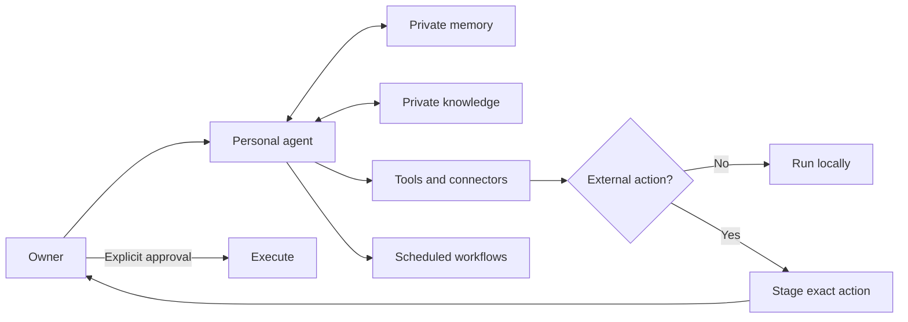

# Henry

Henry is a personal AI agent framework that runs on your computer.

It gives one agent memory, local knowledge, tools, scheduled work, and safe ways
to act. You can use it from the terminal, a private web dashboard, or Telegram.
The framework is public. Your identity, files, credentials, memory, and knowledge
stay in your private setup.

## Why I built it

I wanted an agent that could do more than answer isolated prompts. It should
remember decisions, understand my work, use the tools I already have, and handle
repeatable jobs without pretending every task is safe to automate.

Henry is that operating layer. The model can change. The memory, permissions,
workflows, and approval history remain under the owner's control.

## What it can do

- Remember durable preferences and decisions through Engram
- Search a private knowledge base with local embeddings and source references
- Use connected tools through Codex or Claude
- Run scheduled workflows and reminders
- Coordinate bounded specialist agents through Luna
- Support job research, tailored application material, and application tracking
- Read Gmail through a configured connector and draft replies
- Review pull requests in separate logic, safety, product, performance,
  consistency, and interface passes
- Work through terminal, dashboard, and Telegram

Modules are optional. A fresh setup should start with the owner's problem, then
enable only the workflows that solve it.

## The control model



Reading and local work can happen directly. Email, posts, applications, comments,
and other external actions are staged first. Approval and execution are separate
steps.

## Set up your own agent

Clone the repository, open it in Codex CLI, Claude Code, or Gemini CLI, and say:

```text
Set up this repository as my personal AI agent. Read AGENTS.md, CLAUDE.md,
SETUP-PROMPT.md, SETUP.md, and BOOTSTRAP.md before changing anything. Start by
asking me what problem the agent should solve. Research the use case, recommend a
workflow, and ask me to correct it before implementation. Then configure my
identity, provider, memory, permissions, and selected modules. Run the tests and
do not send anything or commit private data during setup.
```

The detailed paths are in [SETUP.md](SETUP.md), [BOOTSTRAP.md](BOOTSTRAP.md), and
[SETUP-PROMPT.md](SETUP-PROMPT.md).

## Manual start

Requires Node 22 or newer and an authenticated Codex or Claude CLI.

```bash
npm install
cp .env.example .env
cp soul.example.md soul.md
cp personality.example.md personality.md
npm run typecheck
npm test
npm link
henry repl
```

The dashboard runs at `http://127.0.0.1:7337` by default and stays on the local
machine unless secure remote access is explicitly configured.

## Common commands

```bash
henry repl
henry dashboard
henry ask "summarize the current git changes"
henry memory remember "we chose local-first storage"
henry memory search "local-first storage"
henry knowledge add ./notes --domain software-development
henry remind "review the launch plan" --in 2h
henry mailwatch check
henry approve list
```

## Build on it

- [Architecture](docs/architecture.md)
- [Design your agent's operating contract](docs/design-your-soul.md)
- [Rename the complete agent](docs/rename-your-agent.md)
- [Build a private knowledge base](docs/build-your-own-knowledge-rag.md)
- [Connector architecture](docs/connector-architecture.md)
- [Module documentation](docs/modules)

## Privacy

The public repository does not contain the owner's memory, knowledge corpus,
resume, credentials, browser profile, or runtime databases. Those paths are
ignored by Git. Review the ignore rules before adding a new private data source.

## License

MIT. Copyright 2026 Luvish Gulati.
